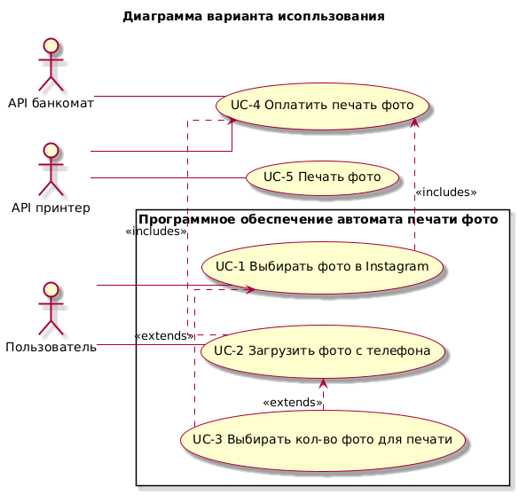

# Итоговая работа по модулю "Анализ требований"

## Содержание
- [Итоговая работа по модулю "Анализ требований"](#итоговая-работа-по-модулю-анализ-требований)
  - [Содержание](#содержание)
  - [Контекст](#контекст)
  - [Задание](#задание)
  - [Решение](#решение)
    - [2. Диаграмма вариантов использования](#2-диаграмма-вариантов-использования)
    - [3. Описание вариантов использования](#3-описание-вариантов-использования)
    - [4. Системные ошибки](#4-системные-ошибки)
    - [5. User Story (Дополнительно)](#5-user-story-дополнительно)

## Контекст
Вы — аналитик команды, которая разрабатывает программное обеспечение для автомата, печатающего фото из Instagram.
На встрече с представителем заказчика выяснили, что автомат должен работать следующим образом:

1. При нажатии на кнопку «Выбрать фото для печати» на главном экране пользователю предложены 2 способа — выбрать фото в Instagram или загрузить фото с телефона.
2. Для выбора фото из Instagram пользователю необходимо указать свой логин. Профиль пользователя должен быть открытым.
3. Для выбора фото с телефона, пользователю нужно соединить телефон с автоматом для печати фото через кабель для зарядки.
4. Пользователь может выбрать количество фотографий для печати через экран автомата. Минимальное количество фото — 1, максимальное —100 (если в автомате достаточно бумаги).
5. Оплатить печать фото можно только по карте через физический терминал бесконтактной оплаты.
6. Печать фото запускается после успешной оплаты выбранного пакета фотографий.
7. Если пользователь вводил логин Instagram для печати фотографий, то после завершения печати его страница в автомате должна быть закрыта.
8. Если пользователь присоединял телефон для печати фотографий, то после завершения печати автомат будет сигнализировать о необходимости забрать телефон.

## Задание

1. Напишите минимум 5 формализованных требований к разрабатываемому программному обеспечению (желательно разных типов, но на ваше усмотрение).
2. Подготовьте диаграмму вариантов использования, покрывающую описанные в контексте действия.
3. Подготовьте текстовое описание любого варианта использования из получившейся на шаге 2 диаграммы.
4. (не обязательно) подумайте и опишите словами, обработку каких системных ошибок нужно учесть при реализации программного обеспечения.

## Решение

| **Обозначение** | **Описание** |
|---|---|
| **1** | Требования функционального характера (ТФХ) |
| **1.1** | Бизнес-требования (БТ) |
| **БТ001** | Необходимо автоматизировать процесс печати фото со страницы профиля Instagram или с мобильного устройства |
| **БТ002** | Необходимо автоматизировать процесс обслуживания автомата печати фото |
| **1.2** | Пользовательские требования (ПТ) |
| **ПТ001** | Пользователь должен иметь возможность выбирать способ печати фото |
| **ПТ002** | Пользователь должен иметь возможность выбирать фото в Instagram для печати |
| **ПТ003** | Пользователь должен иметь возможность выбирать фото с телефона для печати |
| **ПТ004** | Пользователь должен иметь возможность выбирать количество фото для печати |
| **ПТ005** | Пользователь должен иметь возможность оплачивать печать фото |
| **ПТ006** | Пользователь должен иметь возможность печатать фото |
| **1.3** | Функциональные требования (ФТ) |
| **ФТ001** | Система должна отображать стоимость печати фото |
| **ФТ002** | Система должна проверять, что кол-во бумаги и чернил для печати фото является минимально достаточным для работы системы |
| **ФТ003** | Система должна предоставлять возможность выбирать способ печати фото в Instagram |
| **ФТ004** | Система должна предоставлять возможность выбирать способ печати фото c телефона |
| **ФТ005** | Система должна предоставлять возможность вводить имя профиля Instagram |
| **ФТ006** | Система должна искать профиль Instagram |
| **ФТ007** | Система должна проверять доступность профиля Instagram |
| **ФТ008** | Система должна оповещать о недоступности профиля Instagram |
| **ФТ009** | Система должна отображать фото, приведенные на странице профиля Instagram |
| **ФТ010** | Система должна предоставлять возможность выбирать фото в Instagram для печати |
| **ФТ011** | Система должна оповещать о возможности соединить телефон с автоматом для печати фото через кабель зарядки |
| **ФТ012** | Система должна отображать фото с телефона |
| **ФТ013** | Система должна предоставлять возможность выбирать фото с телефона для печати |
| **ФТ014** | Система должна предоставлять возможность выбирать кол-во копий фото для печати |
| **ФТ015** | Система должна проверять, что выбранное пользователем кол-во фото для печати не менее 1 и не более 100 штук |
| **ФТ016** | Система должна проверять, что кол-во бумаги и чернил для печати фото в автомате является достаточным для выбранного кол-ва фото |
| **ФТ017** | Система должна оповещать пользователя о недостаточном кол-ве бумаги или чернил для выбранного кол-ва фото |
| **ФТ018** | Система должна отображать итоговую стоимость печати фото |
| **ФТ019** | Система должна предоставлять возможность оплатить печать фото по карте через физический терминал бесконтактной оплаты |
| **ФТ020** | Система должна блокировать прием оплаты печати фото при недостаточном кол-ве бумаги или чернил |
| **ФТ021** | Система должна запускать печать фото только после успешной оплаты |
| **ФТ022** | Система должна закрыть автоматически страницу профиля Instagram после завершения печати |
| **ФТ023** | Система должна сигнализировать о необходимости ивзлечь телефон после завершения печати |
| **2** | Требования нефункционального характера (ТНФХ) |
| **2.1** | Бизнес-правила (БП) |
| **БП001** | Страница оплаты должна соответствовать требованиям федерального закона №54-ФЗ при обработке платежей, выполняемых с использованием электронных денег и банковских карт |
| **2.2** | Системные требования (СТ) |
| **СТ001** | В автомате должеж быть физический терминал бесконтактной оплаты |
| **СТ002** | В автомате должен быть принтер |
| **СТ003** | В автомате должны быть кабели зарядки (USB Type C, microUSB, ligthning) |
| **2.3** | Атрибуты качества (АК) |
| **АК001** | Время отклика системы на действия пользователя не должно превышать 2 секунд |
| **АК002** | Время загрузки фото из Instagram не должно превышать 5 секунд |
| **АК003** | Время загрузки фото с телефона не должно превышать 5 секунд |
| **АК004** | Время печати одного фото не должно превышать 10 секунд |
| **АК005** | Система должна поддерживать последовательную печать до 100 фото для одного заказа |
| **АК006** | Интерфейс программного обеспечения должен быть интуитивно понятным для пользователей всех возрастов |
| **АК007** | Интерфейс должен быть адаптирован для сенсорного дисплея |
| **АК008** | Система должна иметь интуитивно понятный интерфейс на русском языке |
| **АК009** | Все важные действия должны быть доступны не более чем в 5 кликах |
| **АК010** | Система должна предоставлять понятные подсказки и инструкции |
| **АК011** | Система должна поддерживать актуальные версии iOS и Android |
| **АК012** | Обработка ошибок при вводе некорректного логина Instagram |
| **АК013** | Обработка ошибок при подключении мобильного устройства |
| **АК014** | Обработка ошибок при несоответствии допустимого количества фото для печати (от 1 до 100 фото) |
| **АК015** | Обработка ошибок при сбоях в работе физического терминала бесконтактной оплаты |
| **АК016** | Обработка ошибок при отсутствии подключения к интернету |
| **АК017** | Обработка ошибок при недостатке бумаги, чернил в принтере |
| **АК018** | Система должна обеспечивать безопасное соединение при работе с Instagram |
| **АК019** | Система должна защищать данные банковских карт при оплате |
| **АК020** | Система должна автоматически очищать кэш после завершения сессии |
| **2.4** | Внешние системы и интерфейсы (ВСИ) |
| **ВСИ001** | Интеграция с API Instagram для получения фото по протоколу HTTPS |
| **ВСИ002** | Интеграция с системой безналичной оплаты |
| **ВСИ003** | Интеграция с системой управления принтером |
| **2.5** | Ограничения (ОГР) |
| **ОГР001** | В качестве операционной системы должна использоваться Astra Linux |
| **ОГР002** | В качестве основного языка программирования использовать JavaScript |
| **ОГР003** | Для разработки пользовательского интерфейса использовать React |
| **ОГР004** | Пользовательский интерфейс должен быть разработан для сенсорного дисплея с диагональю 32" и разрешением 1920х1080 пикселей |
| **ОГР005** | Для создания API использовать Node.js |
| **ОГР006** | Для разработки серверной части использовать NEST.js |
| **ОГР007** | В качестве СУБД использовать Postgres Pro |
| **ОГР008** | Для кэширования использовать Redis |

### 2. Диаграмма вариантов использования

Ниже приведена диаграмма вариантов использования, покрывающая описанные в контексте действия.

### 3. Описание вариантов использования

Описание вариантов использования, приведенных на диаграмме [выше](#2-диаграмма-вариантов-использования), приведены ниже.

| **ID Use Case** | **UC-1** | **Шаг** |
|---|---|---|
| **Название Use Case** | Выбрать фото в Instagram |  |
| **Описание (краткое описание сценария/цель сценария)** | Пользователь вводит имя профиля Instagram и получает доступ к предварительному просмотру фото в профиле Instagram для выбора фото на печать |  |
| **Акторы (основные)** | Пользователь |  |
| **Акторы (вторичные)** | Программное обеспечение автомата для печати фото |  |
| **Начальное состояние (Предусловия-контекст и стартовые данные)** | Профиль Instagram, фотографии которого будут выбираться для печати, является открытым |  |
| **** | Кол-во бумаги или чернил для печати фото в автомате является минимально достаточным для работы принтера |  |
| **Триггер** | Пользователь нажал кнопку "Выбрать фото для печати" |  |
| **Основной успешный сценарий** | Пользователь выбирает способ печати "Выбрать фото в Instagram" | 1 |
| **** | Система предлагает пользователю ввести логин профиля Instagram | 2 |
| **** | Пользователь вводит логин профиля Instagram | 3 |
| **** | Система проверяет доступность профиля Instagram | 4 |
| **** | Система отображает фото профиля Instagram | 5 |
| **** | Пользователь выбирает фото для печати | 6 |
| **Альтернативный сценарий 1 ""Профиль Instagram не найден/закрыт"** |  |  |
| **(Ветлвление от шага 4)"** | Система оповещает пользователя о том, что профиль Instagram является закрытым или не найден и предлагает вернуться на шаг 2 основного успешного сценарий | 4.1.1 |
| **** | Пользователь подтвеждает возвращение на шаг 2 основного успешного сценария | 4.1.2 |
| **** | Система возрвращается на шаг 2 основного успешного сценария | 4.1.3 |
| **Негативный сценарий (исключение) 1 ""Сбой сети"** |  |  |
| **(Ветлвление от шага 4)"** | Система не получила данные профиля из-за сбоя сети | 4.2.1 |
| **** | Система выводит пользователю сообщение "Ошибка соединения. Повторите попытку позже." | 4.2.2 |
| **** | Сценарий прерван: сбой сети | 4.2.3 |
| **Конечное состояние (Постусловия)** | При успешном сценарии пользователь получает доступ к предварительному просмотру фото в профиле Instagram и выбирает фото для печати |  |
| **** | При альтернативном сценарии 1 пользователь не получает доступ к предварительному просмотру фото в профиле Instagram, т.к. профиль не найден/закрыт |  |
| **** | При негативном сценарии 1 пользователь не получает доступ к предварительному просмотру фото в профиле Instagram, т.к. произошел сбой сети |  |
| **Связанные требования (БТ, ПТ, ФТ, US, JS)** | ПТ001, ПТ002, ФТ002, ФТ004-ФТ009, US001, US002 |  |

| **ID Use Case** | **UC-2** | **Шаг** |
|---|---|---|
| **Название Use Case** | Загрузить фото с телефона |  |
| **Описание (краткое описание сценария/цель сценария)** | Пользователь соединяет телефон с автоматом печати и получает доступ к предварительному просмотру фото с телефона для выбора фото на печать |  |
| **Акторы (основные)** | Пользователь |  |
| **Акторы (вторичные)** | Программное обеспечение автомата для печати фото, телефон |  |
| **Начальное состояние (Предусловия-контекст и стартовые данные)** | Пользователь имеет доступ к кабелю зарядки |  |
| **** | Кол-во бумаги или чернил для печати фото в автомате является минимально достаточным для работы принтера |  |
| **Триггер** | Пользователь нажал кнопку "Выбрать фото для печати" |  |
| **Основной успешный сценарий** | Пользователь выбирает способ печати "Загрузить фото с телефона" | 1 |
| **** | Система предлагает пользователю соединить телефон с автоматом для печати фото через кабель для зарядки | 2 |
| **** | Пользователь соединяет телефон с автоматом для печати фото через кабель для зарядки | 3 |
| **** | Система запрашивает доступ к телефону | 4 |
| **** | Телефон получает уведомление на разрешения доступа к фото | 5 |
| **** | Пользователь разрешает доступ к телефону | 6 |
| **** | Система отображает фото с телефона | 7 |
| **** | Пользователь выбирает фото для печати | 8 |
| **Альтернативный сценарий 1 ""Отсутствует доступ к телефону"** |  |  |
| **(Ветлвление от шага 4)"** | Система оповещает пользователя о том, что отсутствует доступ к телефону и предлагает вернуться на шаг 2 основного успешного сценарий | 4.1.1 |
| **** | Пользователь подтвеждает возвращение на шаг 2 основного успешного сценария | 4.1.2 |
| **** | Система возрвращается на шаг 2 основного успешного сценария | 4.1.3 |
| **Негативный сценарий (исключение) 1 ""Неисправность кабеля зарядки"** |  |  |
| **(Ветлвление от шага 7)"** | Система не получила фото с телефона из-за неисправности кабеля зарядки | 7.1.1 |
| **** | Система выводит пользователю сообщение "Ошибка соединения. Повторите попытку позже." | 7.1.2 |
| **** | Сценарий прерван: неисправность кабеля | 7.1.3 |
| **Конечное состояние (Постусловия)** | При успешном сценарии пользователь получает доступ к предварительному просмотру фото с телефона и выбирает фото для печати |  |
| **** | При альтернативном сценарии 1 пользователь не получает доступ к предварительному просмотру фото с телефона, т.к. отсутствует доступ к телефону |  |
| **** | При негативном сценарии 1 пользователь не получает доступ к предварительному просмотру фото с телефона, т.к. неисправен кабель зарядки |  |
| **Связанные требования (БТ, ПТ, ФТ, US, JS)** | ПТ001, ПТ003, ФТ003, ФТ010-ФТ012, US005, US006 |  |

| **ID Use Case** | **UC-3** | **Шаг** |
|---|---|---|
| **Название Use Case** | Выбрать кол-во копий фото для печати |  |
| **Описание (краткое описание сценария/цель сценария)** | Пользователь выбирает кол-во копий выбранных фото для печати |  |
| **Акторы (основные)** | Пользователь |  |
| **Акторы (вторичные)** | Программное обеспечение автомата для печати фото |  |
| **Начальное состояние (Предусловия-контекст и стартовые данные)** | Выполнен основной успешный сценарий для UC-3, т.е. выбрано кол-во копий фото для печати |  |
| **Триггер** | Активация поля ввода кол-ва копий на экране автомата |  |
| **Основной успешный сценарий** | Пользователь выбирает кол-во копий фото, выбранных для печати | 1 |
| **** | Система проверяет, что выбранное пользователем кол-во копий фото не более 100 штук | 2 |
| **** | Пользователь получает оповещение о корректном кол-ве фото | 3 |
| **** | Система проверяет, что кол-во бумаги и чернил для печати фото в автомате является достаточным для выбранного кол-ва копий фото | 4 |
| **** | Пользователь получает оповещение о возможности оплаты печати фото | 5 |
| **** | Система активирует возмножность оплаты печати фото и отображает итоговую стоимость печати фото | 6 |
| **Альтернативный сценарий 1 ""Кол-во выбранных фото превышает 100 штук"** |  |  |
| **(Ветлвление от шага 3)"** | Пользователь получает оповещение о некорректном кол-ве фото | 3.1.1 |
| **** | Система не активирует возможность оплаты печати фото, не отображает итоговую стоимость печати фото и выводит сообщение о разрешенном для печати кол-ве фото | 3.1.2 |
| **** | Система возрвращается на шаг 1 основного успешного сценария | 5.1.1 |
| **Негативный сценарий (исключение) 1 ""Кол-во бумаги или чернил является недостаточным для печати фото""** | Пользователь получает оповещение о невозможности печати фото | 5.1.2 |
| **** | Система выводит пользователю сообщение "Отсутствует бумага или чернила для печати фото" | 5.1.3 |
| **** | Сценарий прерван: недостаточно бумаги или чернил | 5.1.4 |
| **Конечное состояние (Постусловия)** | При успешном сценарии пользователь получает возмножность оплаты печати фото |  |
| **** | При альтернативном сценарии 1 пользователь не получает возмножность оплаты печати фото, т.к. кол-во выбранных фото превышает 100 штук |  |
| **** | При негативном сценарии 1 пользователь не получает возмножность оплаты печати фото, т.к. кол-во бумаги или чернил является недостаточным для печати фото |  |
| **Связанные требования (БТ, ПТ, ФТ, US, JS)** | ПТ001, ПТ003, ФТ003, ФТ010-ФТ012, US005, US006 |  |

| **ID Use Case** | **UC-4** | **Шаг** |
|---|---|---|
| **Название Use Case** | Оплатить печать фото |  |
| **Описание (краткое описание сценария/цель сценария)** | Пользователь оплачивает печать выбранных фото |  |
| **Акторы (основные)** | Пользователь |  |
| **Акторы (вторичные)** | Программное обеспечение автомата для печати фото, физический терминал бесконтактной оплаты |  |
| **Начальное состояние (Предусловия-контекст и стартовые данные)** | Выполнен основной успешный сценарий для UC-1 или UC-2, т.е. выбраны фото для печати в Instagram или с телефона, соответственно |  |
| **** | Кол-во бумаги или чернил для печати фото в автомате является минимально достаточным для работы принтера |  |
| **Триггер** | Пользователь нажал кнопку "Оплата" |  |
| **Основной успешный сценарий** | Система активирует физический терминал бесконтактной оплаты | 1 |
| **** | Физический терминал бесконтактной оплаты активируется | 2 |
| **** | Система выводит сообщение о необходимости приложить карту к терминалу оплаты | 3 |
| **** | Пользователь прикладывает карту к терминалу оплаты | 4 |
| **** | Терминал обрабатывает платеж | 5 |
| **** | Система подтверждает успешную транзакцию | 6 |
| **** | Запускается процесс печати фото | 7 |
| **Альтернативный сценарий 1 ""Отклонение платежа"** |  |  |
| **(Ветлвление от шага 5)"** | Система оповещает об отклонении платежа и предлагает повторить попытку | 3.1.1 |
| **** | Пользователь подтверждает повторную попытку осуществить оплату | 3.1.2 |
| **** | Система возрвращается на шаг 4 основного успешного сценария | 5.1.1 |
| **Негативный сценарий (исключение) 1 ""Сбой сети"** |  |  |
| **(Ветлвление от шага 5)"** | Система не получила данные терминала об оплате из-за сбоя сети | 5.1.2 |
| **** | Система выводит пользователю сообщение "Ошибка соединения. Повторите попытку позже." | 5.1.3 |
| **** | Сценарий прерван: сбой сети | 5.1.4 |
| **Конечное состояние (Постусловия)** | При успешном сценарии запускается процесс печати фото |  |
| **** | При альтернативном сценарии 1 не запускается процесс печати фото, т.к. платеж отклонен |  |
| **** | При негативном сценарии 1  не запускается процесс печати фото, т.к. произошел сбой сети |  |
| **Связанные требования (БТ, ПТ, ФТ, US, JS)** | ПТ001, ПТ003, ФТ003, ФТ010-ФТ012, US005, US006 |  |

### 4. Системные ошибки

При разработке программного обеспечения должная быть реализована обработка следующих системных ошибок:

1. обработка ошибок при вводе некорректного логина Instagram;
2. обработка ошибок при подключении мобильного устройства;
3. обработка ошибок при несоответствии допустимого количества фото для печати (от 1 до 100 фото);
4. обработка ошибок при сбоях в работе физического терминала бесконтактной оплаты;
5. обработка ошибок при отсутствии подключения к интернету;
6. обработка ошибок при недостатке бумаги, чернил в принтере.

### 5. User Story (Дополнительно)

| **№** | **Обозначение** | **Как** | **<Роль>** | **Я хочу** | **<Действие>** | **Чтобы** | **<Цель>** |
|---|---|---|---|---|---|---|---|
| **1** | US001 | Как | Пользователь | Я хочу | вводить имя профиля Instagram | , чтобы | профиль автоматически открывался |
| **2** | US002 | Как | Пользователь | Я хочу | предварительно просматривать фотографии в профиле Instagram | , чтобы | выбрать фотографии для печати |
| **3** | US003 | Как | Пользователь | Я хочу | указывать кол-во фото | , чтобы | распечатать несколько дубликатов для каждой выбранной фотоографии |
| **4** | US004 | Как | Пользователь | Я хочу | автоматичское закрытие страницу профиля Instagram после завершения печати | , чтобы | не нажимать кнопку выхода |
| **5** | US005 | Как | Пользователь | Я хочу | подключать мобильное устройство к автомату печати фото | , чтобы | галерея автоматически открылась на экране автомата |
| **6** | US006 | Как | Пользователь | Я хочу | предварительно просматривать фотографии с мобильного устройства | , чтобы | выбрать фотографии для печати |
| **7** | US007 | Как | Пользователь | Я хочу | получать сигнал о необходимости ивзлечь мобильное устройство после завершения печати через интерфейс автомата | , чтобы | не забыть отсоединить и забрать мобильное устройство |
| **8** | US008 | Как | Пользователь | Я хочу | видеть стоимость печати одной фотографии | , чтобы | посчитать сколько фото можно выбрать для печати |
| **9** | US009 | Как | Пользователь | Я хочу | видеть итоговую стоимость печати всех выбранных фото | , чтобы | знать какую сумму необходимо оплатить |
| **10** | US010 | Как | Пользователь | Я хочу | оплатить печать фото по карте через физический терминал бесконтактной оплаты | , чтобы | быстро осуществить оплату |
| **11** | US011 | Как | Пользователь | Я хочу | получать уведомление о невозможности печати фото | , чтобы | не тратить время на выбор фото |
| **12** | US012 | Как | Пользователь | Я хочу | видеть на экране автомата интсрукции и подсказки | , чтобы | корректно и быстро распечатать выбранные фотографии |
| **13** | US013 | Как | Пользователь | Я хочу | получать подтверждение успешной оплаты перед началом печати | , чтобы | очно знать об успешности оплаты |